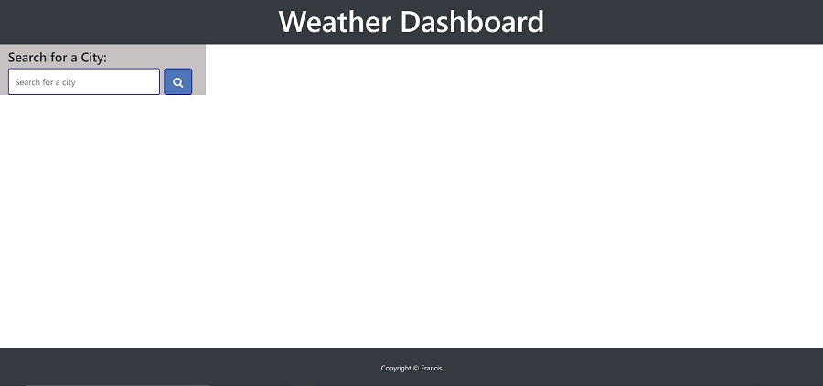
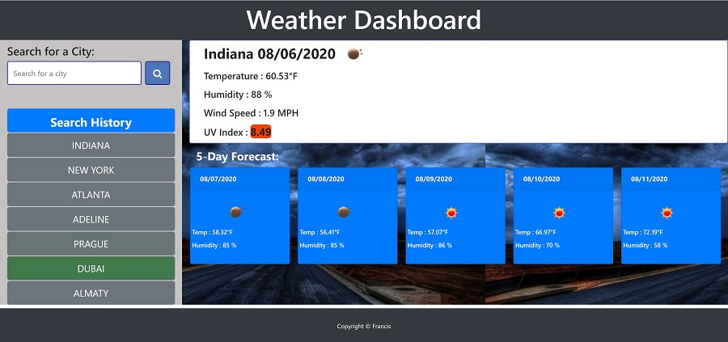

# BRIEF DISCRIPTION

This project is a weather dashboard and useful for business travellers for quick update on the weather status.OpenWeather API (https://openweathermap.org/api) is used retrieve weather data for cities. Moment.js is used to grab the date of the location and local storage is used as temporary data storage.

Data retrieved from the API is sanitized and dynamically updated on the HTML page. This presents a user with a fluid and smooth interface for quick weather update.


## User Story

```
AS A traveler
I WANT to see the weather outlook for multiple cities
SO THAT I can plan a trip accordingly
```

## Acceptance Criteria

```
GIVEN a weather dashboard with form inputs
WHEN I search for a city
THEN I am presented with current and future conditions for that city and that city is added to the search history
WHEN I view current weather conditions for that city
THEN I am presented with the city name, the date, an icon representation of weather conditions, the temperature, the humidity, the wind speed, and the UV index
WHEN I view the UV index
THEN I am presented with a color that indicates whether the conditions are favorable, moderate, or severe
WHEN I view future weather conditions for that city
THEN I am presented with a 5-day forecast that displays the date, an icon representation of weather conditions, the temperature, and the humidity
WHEN I click on a city in the search history
THEN I am again presented with current and future conditions for that city
WHEN I open the weather dashboard
THEN I am presented with the last searched city forecast
```
# Project Landing Page




# Project Weather Page




# Link To Project:

Please click [here](https://anyaegbufrancis.github.io/weather.dashboard/) to view the github hosted project.


## APPROACH

The approach adopted is as follows:

1. A pseudocode was developed in a rough sketch, itemizing the concepts, fuctions, the variables and how they will beconsumed.
2. The base HTML pages are coded.
3. Basic styling was applied to differentiate the codes.
4. API targets and frameworks were identified and applied
5. Tags are applied to each object/element that needs to be targeted to achieve a particular feature.
6. Each base function was coded using Javascript and JQUERY maily.
7. Error checking and fail conditions are checked in the logic and bugs fixed.
8. Naming, Tagging and references are updated to reflect updated logic.
9. Final polishing was applied using CSS.
10. Code was refactored and restested.
11. Few more features were added and old features are optimized.
12. Final code was uploaded to github


## GENERAL DESCRIPTION

The finished project is present in a single index.html page mad up of html, styling and javascript sections. Local Storage was employed as placeholder for values in this project.


